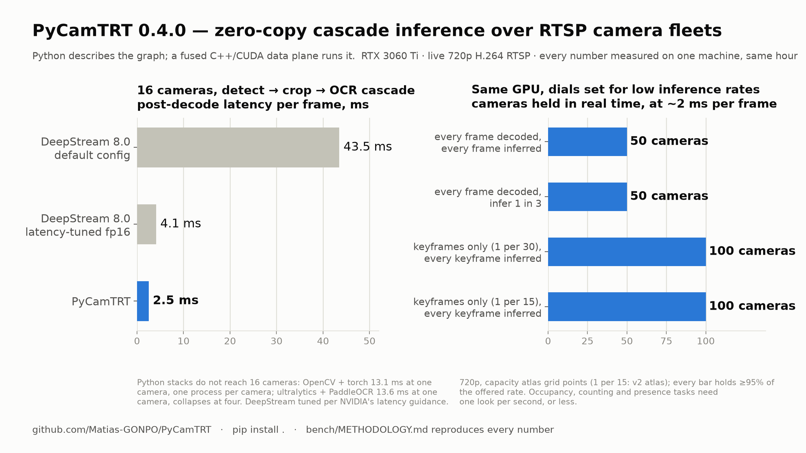
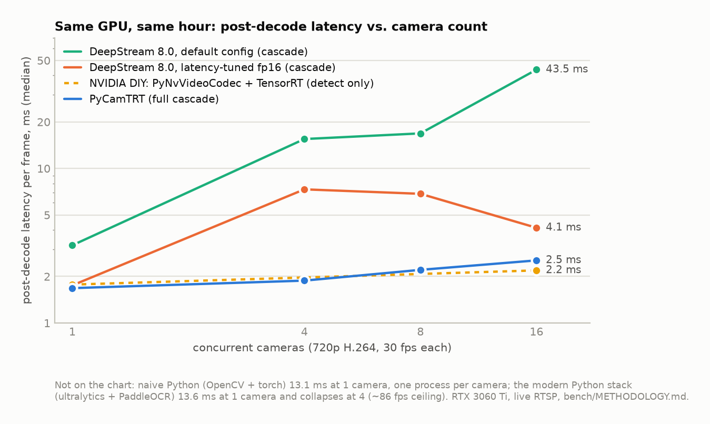
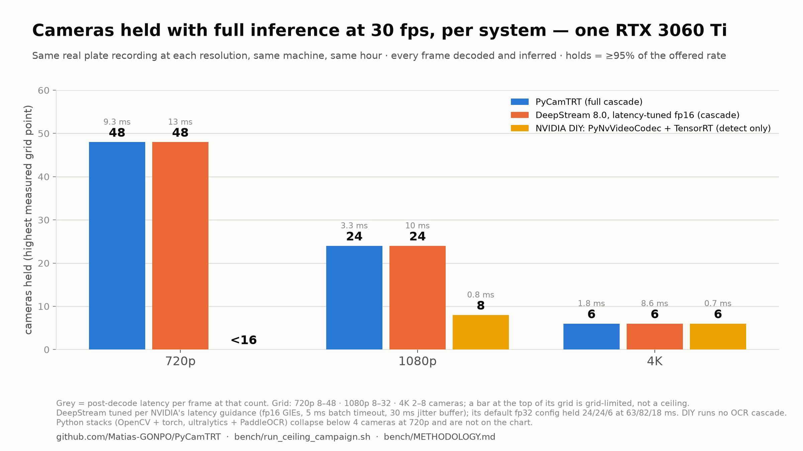
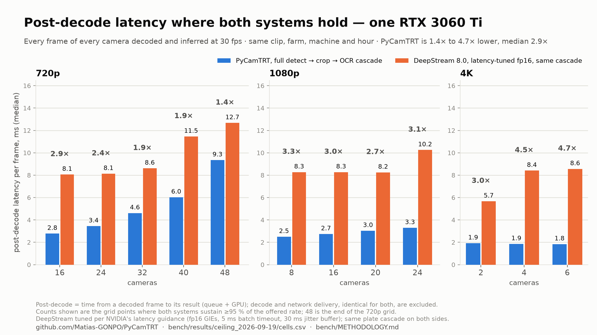
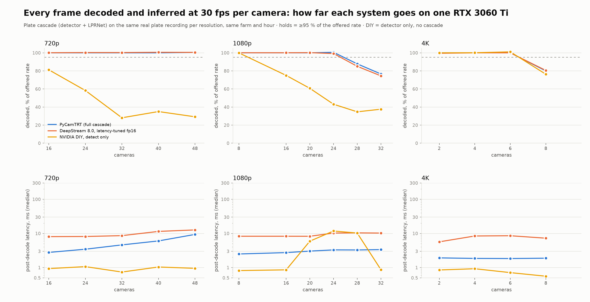
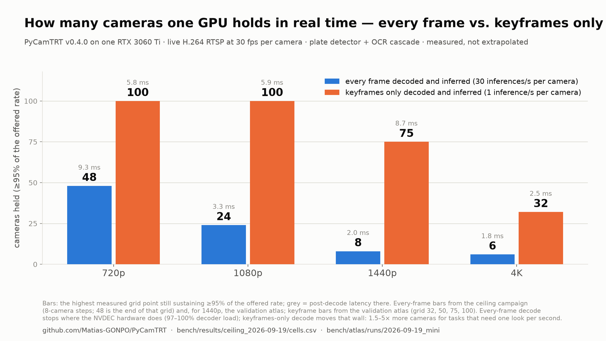
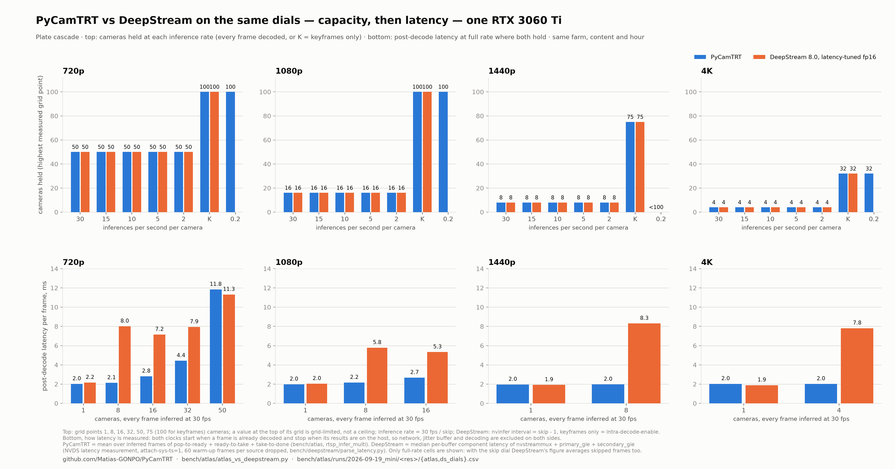
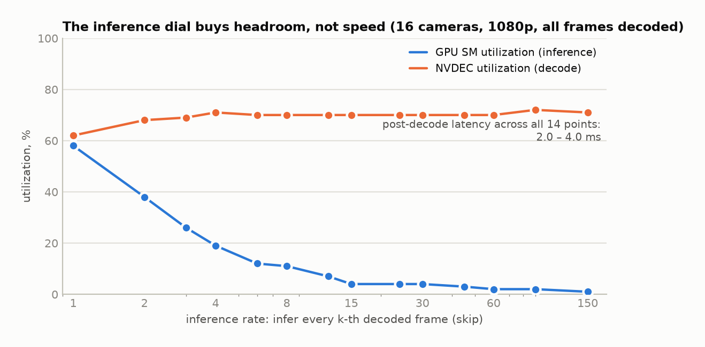

# PyCamTRT

**Python Camera Fleet TensorRT inference Library** — the library that came out of a research
project on efficient RTSP decoding and cascade inference on the GPU: an open-source,
fully-modular library for zero-copy cascade inference over many concurrent RTSP streams. A
Pythonic alternative to NVIDIA DeepStream: the same class of performance, without the closed
internals or the GStreamer learning curve. Current version: **0.4.0** (`CHANGELOG.md`).



```python
import pycamtrt

streams = pycamtrt.Streams(["rtsp://cam1", "rtsp://cam2"])

detect = pycamtrt.Layer("detect")
eng  = detect.add(pycamtrt.Engine(streams, "models/yolov8n_plates_b1-16_fp16_sm86.engine"))
dets = detect.add(pycamtrt.Postprocess(eng, family="yolo", score=0.4))

read = pycamtrt.Layer("read")                      # cascade: crops each detection on the GPU
oeng = read.add(pycamtrt.Engine(dets, "models/lprnet_b1-32_fp32_sm86.engine"))
read.add(pycamtrt.Postprocess(oeng, family="ctc"))

with pycamtrt.Pipeline(streams, layers=[detect, read], skip=2) as pipe:
    for r in pipe:                                  # ~3 ms/frame at 16 cameras
        print(r.stream_id, r.outputs["read"])
```

Python **describes** the processing graph; a fused C++/CUDA data plane **executes** it. No
Python code ever runs in the per-frame path — pixels go RTSP → NVDEC → inference → GPU
postprocess entirely in VRAM, and only compact results (boxes, text, labels; ~KB/frame)
cross into Python.

## Measured (RTX 3060 Ti, 720p H.264 live RTSP — same hour, same machine, reproducible via `bench/`; driver 570.133.07 at the time — see *Versions* below)

Post-decode latency per frame (batching wait + inference + cascade; the clock-fair figure —
see `bench/METHODOLOGY.md`):

| | workload | 1 cam | 16 cams (480 fps offered) |
|---|---|---|---|
| Naive Python (OpenCV + torch fp32) | detect | 13.1 ms | process-per-camera |
| Modern stack (ultralytics + PaddleOCR) | cascade | 13.6 ms | collapses at 4 cams (~86 fps ceiling) |
| NVIDIA DIY (PyNvVideoCodec + TensorRT, thread/stream) | detect only¹ | 1.8 ms | 2.2 ms |
| DeepStream 8.0, default config | cascade | 3.2 ms | 43.5 ms |
| DeepStream 8.0, latency-tuned fp16 | cascade | 1.8 ms | 4.1 ms |
| **PyCamTRT** | **full cascade** | **1.7 ms** | **2.5 ms** (2.95 end-to-end), GPU 64% busy |

¹ the DIY row runs no OCR cascade (building crop machinery is where 150-line DIY ends), needed
a third-party demuxer for live RTSP, and OOM'd until its engine profile was hand-tuned —
details and raw logs in `bench/`.

Plate-content cascade, same night (19 September 2026): 16 cameras at 720p, PyCamTRT 2.8 ms vs tuned DeepStream 8.1 ms (2.9×); 24 at 1080p, 3.3 vs 10.2 ms (3.1×).
Endurance: 45-min parallel-cascade soak — 647,867 results, zero drops, flat RSS
(and a 3.5 h / 16-stream soak: 3,023,750 results, zero drops, 3 MB RSS band).

**The three load dials, measured.** Capacity is a function of *stream count × decode rate ×
inference rate*; latency is the outcome. Every row below is a measured cell from the
336-cell capacity atlas behind `pycamtrt.recommend()` (720p shown; the grids are
re-measured per resolution). *full* = best quality on that dial (every camera / every
frame decoded / every decoded frame inferred); *½* = the middle setting; *min* = the most
GPU-sparing one. The three rows above 16 cameras were re-measured on 19 September 2026 with the v0.4.0 decoder (validation atlas); the rows at or below 16 cameras are the v2 atlas and agree with the re-measurement within 0.5 ms:

| profile | cams | decode | inference | decoded→inferred fps | latency (ms) | holds | NVDEC/SM % | binds on |
|---|---|---|---|---|---|---|---|---|
| everything full | 16 | all 30/s | every frame | 480→480 | 3.26 | 97% | 36/64 | nothing (offered-bound) |
| streams min, rest full | 1 (min) | all 30/s | every frame | 30→30 | 2.08 | 99% | 2/6 | nothing |
| decode min, rest full | 16 | key 1/s (min) | every frame | 16→16 | 1.96 | 95% | 2/3 | nothing |
| inference min, rest full | 16 | all 30/s | skip 30 (min) | 480→16 | 2.05 | 97% | 36/3 | nothing |
| streams ½ | 8 (½) | all 30/s | every frame | 240→240 | 2.22 | 97% | 18/36 | nothing |
| decode ½ | 16 | key 2/s (½) | every frame | 32→32 | 1.94 | 98% | 4/6 | nothing |
| inference ½ | 16 | all 30/s | skip 2 (½) | 480→240 | 2.64 | 97% | 36/39 | nothing |
| streams+decode ½ | 8 (½) | key 2/s (½) | every frame | 16→16 | 1.95 | 98% | 2/3 | nothing |
| streams+inference ½ | 8 (½) | all 30/s | skip 2 (½) | 240→120 | 2.10 | 98% | 18/20 | nothing |
| decode+inference ½ | 16 | key 2/s (½) | skip 2 (½) | 32→16 | 1.98 | 98% | 4/3 | nothing |
| all three ½ | 8 (½) | key 2/s (½) | skip 2 (½) | 16→8 | 1.94 | 98% | 2/2 | nothing |
| everything min (floor) | 1 (min) | key 1/s (min) | skip 6 (min) | 1→0.2 | 2.46 | 100% | 0/0 | nothing |
| twice the design point | 32 | all 30/s | every frame | 960→960 | 4.4 | 97% | 64/85 | nothing (offered-bound) |
| the full-rate wall | 50 | all 30/s | every frame | 1500→1440 | 11.8 | 96% | 100/94 | NVDEC and GPU, together |
| past the wall | 75 | all 30/s | every frame | 2250 offered | 11.7 | 64% | 100/93 | NVDEC |
| the 100-camera mode | 100 | key 1/s | every frame | 100→100 | 3.67 | 95% | 11/17 | nothing (mixed/ramp) |

The table's shape is the product's story: at or below the design point the latency is a
flat ~2–3.3 ms *no matter which dial you turn* — the dials buy **headroom** (NVDEC/SM
utilization), not speed, until you cross the knee (row 13) and queueing takes over. The
full-rate ceiling, measured head-to-head against DeepStream on 19 September 2026, is 48 cameras
at 720p (end of the grid, decoder at 97%), 24 at 1080p and 6 at 4K — the NVDEC wall — and
`decode="key"` moves that wall: 100 cameras at 3.7 ms on this same GPU. (The atlas rows above
were measured before the v0.4.0 decoder fix, whose full-inference ceilings were half the wall;
their latency and headroom numbers at or below the design point are unchanged.) Inference cost is
resolution-invariant (the detector's input tensor is fixed); decode is the pixel-bound
resource. More measured price tags: SAHI tiling costs `0.305 + 0.496·T` ms/frame at T
tiles (pooled cross-camera batching, R² ≥ 0.9999; serial `0.998 + 0.490·T`, keyframe
`3.185 + 0.482·T`); `Select` routing cut per-child GPU time 36% with half the detections
routed; non-640 detectors measure 0.57× (416) and 3.25× (1280) of the 640 cost;
`recommend()`'s prediction lands within 0.6% of the measured cell it is gated against.
Every feature ships with a verification gate (bit-exact CPU references where possible):
`python/qa_matrix.py` A–L and the `src/*_test.cpp` checkpoints.

## The comparison in pictures

Every point below is a measured cell — `bench/` for the head-to-head, the capacity atlas
behind `pycamtrt.recommend()` for the dials. Same GPU (RTX 3060 Ti), live RTSP, no
extrapolation; each figure has its numbers in the table right under it, and
the scripts in `bench/` regenerate them from `bench/results/` and `bench/atlas/` (`figures.py`, `figures_ceiling.py`,
`figures_ceiling_lines.py`, `figures_latency_pairs.py`, `figures_max_streams.py`, `figures_hero.py`, `atlas/atlas_vs_deepstream.py`).

**Head-to-head: post-decode latency as cameras are added.** DeepStream's default
configuration queues; its latency-tuned fp16 configuration holds but at 4.1 ms; PyCamTRT
runs the full detect → crop → OCR cascade at 2.5 ms on 16 cameras, with the GPU 64% busy.
The NVIDIA DIY row (PyNvVideoCodec + TensorRT, detect only, no cascade) is the honest
"what if I wire NVIDIA's own Python pieces myself" baseline.

<picture>
  <source media="(prefers-color-scheme: dark)" srcset="docs/img/bench_latency_vs_cameras-dark.png">
  
</picture>

<details><summary>numbers (post-decode ms per frame, median; 720p H.264 at 30 fps per camera)</summary>

| cameras | PyCamTRT (cascade) | DeepStream tuned fp16 | DeepStream default | NVIDIA DIY (detect only) |
|---|---|---|---|---|
| 1 | 1.68 | 1.75 | 3.18 | 1.77 |
| 4 | 1.88 | 7.32 | 15.5 | — |
| 8 | 2.21 | 6.85 | 16.9 | — |
| 16 | 2.54 | 4.13 | 43.5 | 2.19 |

Naive Python (OpenCV + torch fp32): 13.1 ms at 1 camera, one process per camera. Modern
Python stack (ultralytics + PaddleOCR): 13.6 ms at 1 camera, collapses at 4 (~86 fps ceiling).
</details>

**How far each system goes: the same-night ceiling campaign (19 September 2026).** Five
systems on the same farm, the same real plate recording per resolution, the same hour; every
frame of every camera decoded and inferred at 30 fps; *holds* = at least 95% of the offered
rate. PyCamTRT holds as many cameras as latency-tuned DeepStream at every resolution — 48 at
720p (the end of the grid, with the hardware decoder at 97%), 24 at 1080p, 6 at 4K — at 2 to
5 times lower post-decode latency: 1,447 frames per second through detector + OCR at 720p on
one RTX 3060 Ti, 3.3 ms at 1080p with 24 cameras against 10.2 ms, 1.8 ms at 4K against 8.6 ms.
Against DeepStream's shipped default (fp32) configuration it is twice the cameras at 720p at
one seventh of the latency. Both leaders stop where NVDEC does: the ceiling is the silicon.

<picture>
  <source media="(prefers-color-scheme: dark)" srcset="docs/img/ceiling_systems-dark.png">
  
</picture>

<picture>
  <source media="(prefers-color-scheme: dark)" srcset="docs/img/ceiling_latency_pairs-dark.png">
  
</picture>

<picture>
  <source media="(prefers-color-scheme: dark)" srcset="docs/img/ceiling_curves-dark.png">
  
</picture>

<details><summary>numbers (cameras held, post-decode ms there; 30 fps per camera, plate cascade)</summary>

| | PyCamTRT (cascade) | DeepStream tuned fp16 | DeepStream default fp32 | NVIDIA DIY (detect only) |
|---|---|---|---|---|
| 720p | 48, 9.3 ms | 48, 12.7 ms | 24, 63 ms | below 16 (81% at 16) |
| 1080p | 24, 3.3 ms | 24, 10.2 ms | 24, 82 ms | 8, 0.8 ms |
| 4K | 6, 1.8 ms | 6, 8.6 ms | 6, 17.9 ms | 6, 0.7 ms |

Latency at every count where both leaders hold, PyCamTRT vs tuned DeepStream: 720p 16/24/32/40/48
cameras 2.8/3.4/4.6/6.0/9.3 ms vs 8.1/8.1/8.6/11.5/12.7 ms; 1080p 8/16/20/24 cameras 2.5/2.7/3.0/3.3 ms
vs 8.3/8.3/8.3/10.2 ms; 4K 2/4/6 cameras 1.9/1.9/1.8 ms vs 5.7/8.4/8.6 ms. At the 1080p wall PyCamTRT
decodes 737 fps and DeepStream 715, both with the decoder counter at 98–100%. DeepStream's default
configuration is GPU-bound in fp32 and erratic above 32 cameras at 720p; the DIY baseline (one decode
and inference context per thread) is erratic above its ceiling. `bench/results/ceiling_2026-09-19/cells.csv`;
DeepStream's default configuration is in the table and the CSV but not on the charts. Regenerate with
`python3 bench/figures_ceiling.py bench/results/ceiling_2026-09-19/cells.csv`,
`python3 bench/figures_latency_pairs.py bench/results/ceiling_2026-09-19/cells.csv docs/img/ceiling_latency_pairs` and
`python3 bench/figures_ceiling_lines.py bench/results/ceiling_2026-09-19/cells.csv docs/img/ceiling_curves`.
</details>

**The decode dial moves the wall.** Every-frame decode stops where NVDEC does: 48 cameras at
720p (end of the campaign grid; the atlas grid holds 50), 24 at 1080p, 8 at 1440p, 4 at 4K. Decoding
keyframes only pushes the same GPU to 100 cameras at 720p and 1080p, 75 at 1440p and 32 at 4K at the
same ~2 ms, because the decoder is the pixel-bound resource and inference cost is resolution-invariant.
Measured 19 September 2026 on the v0.4.0 decoder; `python3 bench/figures_max_streams.py` regenerates
the figure below.

<picture>
  <source media="(prefers-color-scheme: dark)" srcset="docs/img/max_streams_every_vs_keyframes-dark.png">
  
</picture>

<details><summary>numbers (cameras held, post-decode ms there; every-frame from the campaign grid, 1440p and keyframes from the validation atlas)</summary>

| | every frame decoded and inferred | keyframes only, every keyframe inferred |
|---|---|---|
| 720p | 48 (end of grid), 9.3 ms | 100, 5.8 ms |
| 1080p | 24, 3.3 ms | 100, 5.9 ms |
| 1440p | 8, 2.0 ms | 75, 8.7 ms |
| 4K | 6, 1.8 ms | 32, 2.5 ms |
</details>

**DeepStream on the same dials.** DeepStream has both dials too (`interval` on the primary
engine, `intra-decode-enable` on the sources), so the validation atlas of 19 September ran it on
the same grid, farm and content. Capacity is identical at every resolution and inference rate,
because both stop at the same walls: NVDEC for every-frame decode, VRAM for keyframe-only decode at
1440p and 4K. What differs is latency at full rate below the wall (2.0 to 2.8 ms against 5.3 to 8.3 ms
at 8 to 16 cameras) and the Python surface. `bench/atlas/atlas_vs_deepstream.py` regenerates the figure.

<picture>
  <source media="(prefers-color-scheme: dark)" srcset="docs/img/dials_vs_deepstream-dark.png">
  
</picture>

**The inference dial buys headroom, not speed.** At 16 cameras and 1080p, inferring every
k-th decoded frame takes GPU-SM load from 58% to 1% while NVDEC stays at ~70% and latency
stays at 2–4 ms: the two resources are independent, which is what lets the next figure
trade inference rate for camera count.

<picture>
  <source media="(prefers-color-scheme: dark)" srcset="docs/img/dials_inference_headroom-dark.png">
  
</picture>

<details><summary>numbers (16 cameras, 1080p, all frames decoded)</summary>

| skip | 1 | 2 | 3 | 4 | 6 | 8 | 12 | 15 | 24 | 30 | 45 | 60 | 90 | 150 |
|---|---|---|---|---|---|---|---|---|---|---|---|---|---|---|
| GPU SM % | 58 | 38 | 26 | 19 | 12 | 11 | 7 | 4 | 4 | 4 | 3 | 2 | 2 | 1 |
| NVDEC % | 62 | 68 | 69 | 71 | 70 | 70 | 70 | 70 | 70 | 70 | 70 | 70 | 72 | 71 |
| latency ms | 4.0 | 2.9 | 3.2 | 2.6 | 2.5 | 2.6 | 2.4 | 2.3 | 2.4 | 2.3 | 2.1 | 2.0 | 2.1 | 2.0 |
</details>

## Features

- **Any TensorRT model** (clean ONNX→engine export is the only contract): per-engine
  normalization/color knobs, six postprocess families (`yolo`, `yolo-e2e` NMS-free heads,
  `rtdetr`, `ctc`, `argmax`, and `embedding` raw-vector pass-through for re-ID/feature
  heads) — and a documented recipe for adding your own (`docs/ADDING_A_FAMILY.md`).
  Detector input size is read from the engine (640, 416, 1280 … all first-class).
- **Depth-2 cascade trees**: one detector feeding N sibling recognizers (OCR + classifier
  simultaneously), crops cut from full-res frames in VRAM; children run on their own CUDA
  streams (`cascade_serial=False`) with per-child GPU timings surfaced
  (`ChildOutput.ms_gpu`).
- **Detection routing** (`Select`): declarative, model-agnostic per-child filters —
  `Select(dets, classes={0}, min_size=32)` sends only matching crops to that branch
  (person→re-ID, vehicle→classifier), strictly reducing work (measured: −36% per-child
  GPU at half-crops routed); results stay aligned.
- **Engine auto-build**: point `Engine()` at a `.onnx` — the TensorRT engine is built once
  per GPU and cached (no hand-typed trtexec incantations).
- **SAHI tiled inference** (per-layer, pooled cross-camera batching) for small/far
  objects, with a measured linear cost model per decode regime (see the atlas table).
- **Per-camera load dials**: `skip`, `decode="key"` (keyframe-only; the 100-camera mode),
  mixable per stream.
- **Files as first-class inputs**: MP4/H.264/H.265 files run through the identical
  pipeline (clean EOF semantics) — deterministic replays for CI and regression work.
- **Fleet resilience, verified under abuse**: per-stream reconnect-with-backoff (survives
  live camera kills), drop-oldest backpressure with per-stream eviction accounting
  (`dropped_results()`), and clean recovery once a deliberate overload is lifted.
- **Endpoint sinks that cannot backpressure the pipeline**: NDJSON event streams, live RTSP
  republish of the original video (no re-encode — compressed frames are teed host-side),
  pre-roll event clips.
- **Three-tier frame access**: printable VRAM addresses, D2H numpy fetch, and zero-copy
  `__cuda_array_interface__` views consumable by torch/CuPy. *(Tier 2/3 currently
  experimental — see Known limitations.)*
- **`pycamtrt.recommend()`**: capacity planning from a measured atlas — streams × decode rate
  × inference rate → predicted latency and which resource binds first.

## Versions, OS and requirements

Everything in this README was measured and verified on one machine. Other Linux + NVIDIA
setups should work, but this is the stack that is known to:

| component | tested with | notes |
|---|---|---|
| OS / kernel | Ubuntu 22.04.5 LTS, kernel 6.8 (HWE) | Linux x86-64 only |
| GPU | GeForce RTX 3060 Ti (Ampere, sm_86, 8 GB) | needs NVDEC; other architectures via `-DCMAKE_CUDA_ARCHITECTURES` (BUILD.md) |
| NVIDIA driver | 580.178.04 (numbers above measured on 570.133.07) | **≥ 570 required** — the Video Codec SDK 13.0 floor |
| Container | `nvcr.io/nvidia/tensorrt:25.08-py3` (root `Dockerfile`) | CUDA 12.6, TensorRT 10.12.0, Python 3.10, cmake 3.22, gcc 11.4 |
| Docker | 28.x + nvidia-container-toolkit 1.17.8 | `--gpus all`, `NVIDIA_DRIVER_CAPABILITIES=compute,utility,video` |
| NVIDIA Video Codec SDK | 13.0 | manual download into `third_party/Video_Codec_SDK/`; not redistributable |
| FFmpeg | libavformat/libavcodec/libavutil (apt, in the container); ffmpeg 8.0 CLI on the host for the stream farm and tools | any 6.x+ should do |
| Python (dev route) | 3.11 with numpy 2.3 (host env mounted into the container) | `requires-python >= 3.10`; runtime dependency: numpy only |
| mediamtx | 1.19.2 | the RTSP/WebRTC server behind `tools/stream_farm/` and `examples/fleet_demo/` |
| Optional | torch 2.12 (cu126) for tier-3 zero-copy views · ultralytics 8.4 for the model exports · FastAPI 0.141 + uvicorn 0.52 for `fleet_demo` | none needed by the library itself |

Sources: H.264 or H.265 over RTSP, or MP4/H.264/H.265 files. Engines are built per GPU
from ONNX and cached, so a different GPU only means a first-run build.

## Getting started

Everything builds and runs inside a CUDA/TensorRT container (host needs only the NVIDIA
driver + docker); the provided `Dockerfile` is the zero-thought environment. One manual
prerequisite: the NVIDIA Video Codec SDK unpacked into `third_party/Video_Codec_SDK/`
(free download; its license forbids us redistributing it). **`BUILD.md` is the full build
manual** — short form:

```bash
docker build -t pycamtrt-dev .
docker run --rm --gpus all --network host -e NVIDIA_DRIVER_CAPABILITIES=compute,utility,video \
  -v $PWD:/workspace -w /workspace pycamtrt-dev bash -c "pip install ."
# that's the whole build: pycamtrt (with its compiled data plane) is now in
# site-packages — no PYTHONPATH, no cmake incantation. (Source install: the
# container is still the build environment; prebuilt wheels are roadmap.
# The classic cmake/make developer workflow lives on in BUILD.md §2.)
# engines build THEMSELVES: point Engine()/--engine at a .onnx and it is
# built once per GPU and cached (models/README.md; trtexec appendix in BUILD.md).
# ultralytics-derived exports are recreated locally: python/export_ultralytics.py
# no cameras? tools/stream_farm/farm.sh simulates an RTSP fleet from a recorded clip.
# then: python3 examples/read_plates/read_plates.py rtsp://localhost:8554/cam1
```

## Repository layout

```
src/            C++/CUDA data plane (src/core/ = the pipeline library; *_test.cpp = checkpoints)
src/python/     pybind11 binding (_pycamtrt)
python/         the pycamtrt package + the acceptance matrix (qa_matrix.py) and harnesses
examples/       one subdir per example (read_plates/, route_and_reid/ - routing + re-ID
                showcase, detect_rtdetr/, classify_detections/, read_and_classify/ - 3-model
                tree, zone_filter/), each with its .py, a C++ port, a README, and a Dockerfile
tools/          RTSP stream farm, SAHI parity checker
docs/           the book (Zero-Copy Vision Part 3), ADDING_A_FAMILY.md
models/         .onnx exports + auto-built engine cache — provenance/licenses in models/README.md
bench/          the DeepStream head-to-head harness, METHODOLOGY.md, the atlas grids and figures.py
BUILD.md        the build manual (Dockerfile route, traps, trtexec appendix)
MANUAL.md       the Python manual (classes, building a graph, worked examples)
THIRD_PARTY.md  third-party components and model licensing
```

**Read `MANUAL.md`** for the full Python manual — every class and function, how the graph
compiles into a running pipeline, and a guided tour of all six examples plus the
`fleet_demo` live app.

**Read `docs/book/ZERO_COPY_VISION_PART3.txt`** for the full story: architecture, the build, the
benchmarks, and the capacity-atlas method (historical narrative through v0.1.0 — later
changes live in `CHANGELOG.md`).

## Known limitations (v0.4.0 — honest list)

No object tracker in the core yet (frames between `skip` detections carry no boxes; `examples/fleet_demo/` ships an app-level IoU tracker) · a `Sink(kind="stream")` relay's first connection replays its ring backlog at realtime pace, so relayed video sits a fixed few seconds behind the detections (measured 7.4 s; `fleet_demo` plays its sources directly, MANUAL §4.2) · `recommend()` and the atlas behind it were calibrated before the v0.4.0 decoder fix, so their every-frame predictions above 24 cameras at 720p / 16 at 1080p are conservative (they say "over capacity" where the measured build holds) · no annotated-video
output yet (planned: GPU draw + NVENC sink) · `hold_frames` tier-2/3 frame access
had a rare exit-time crash in earlier internal builds — not reproduced in v0.2.0 across
140 hunt attempts (see FINDINGS), but the write site was never localized, so treat it as
suppressed rather than proven-fixed · single-GPU ·
depth-2 trees only · layer-0 engines
need a TensorRT profile with kMIN batch 1 (min>1 profiles are rejected with a named error) ·
`pycamtrt.recommend()`'s cost constants were measured at 640×640; non-640 nets run
first-class and their costs are measured (416 ≈ 0.57×, 1280 ≈ 3.25× the 640 baseline) but
not yet modeled per-size ·
all performance constants measured on one GPU (RTX 3060 Ti) — build
your own atlas for other hardware (the book's chapter 7 shows how).

## Roadmap

Object tracker (SORT-lite in the core; predicted boxes on skipped frames) · annotated-video
output (GPU draw + NVENC RTSP sink) · chained cascades (depth-3+: detector-inside-crop, e.g.
car → plate detector → OCR) · multi-GPU · prebuilt pip wheels (source `pip install .`
shipped in v0.3.0; the wheel needs no build environment at all) · a `--deterministic`
fixed-batching mode for byte-exact file replay.

## Provenance

PyCamTRT is the library release of a research project — a from-the-silicon-up
zero-copy pipeline built step by verified step (frame tracing, GPU postprocess migration,
multi-stream batching, capacity atlases, a DeepStream head-to-head). The development history,
reports, and measurement campaigns live in the research project's repository.

Licensed under the MIT License — see `LICENSE`.
